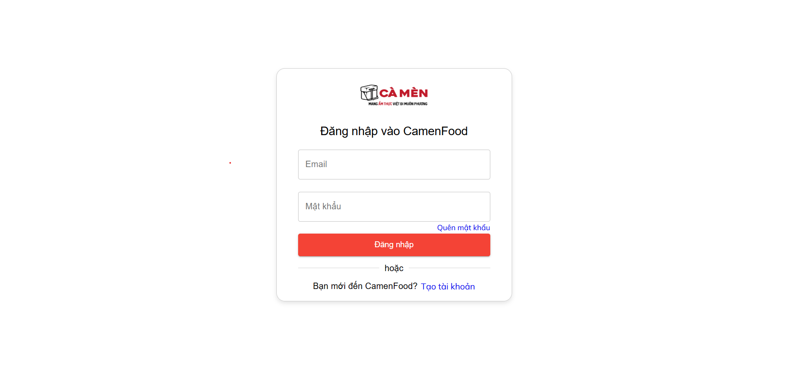
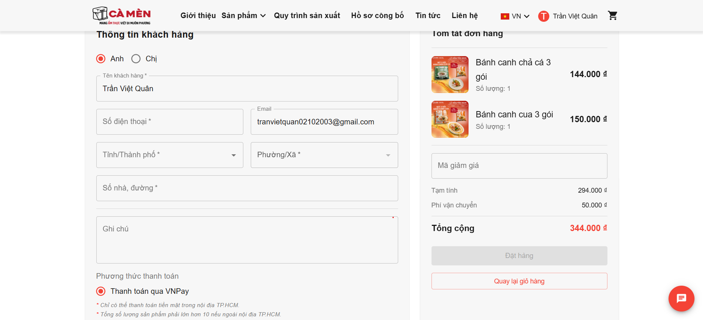
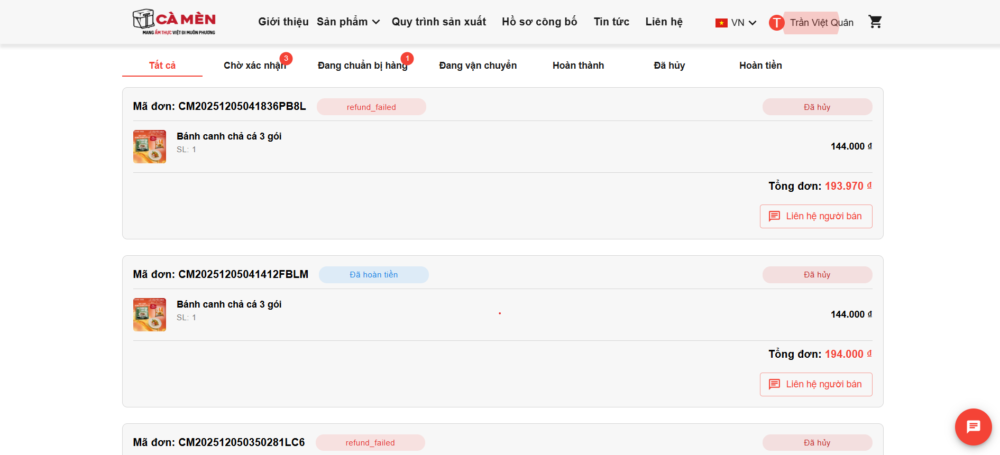
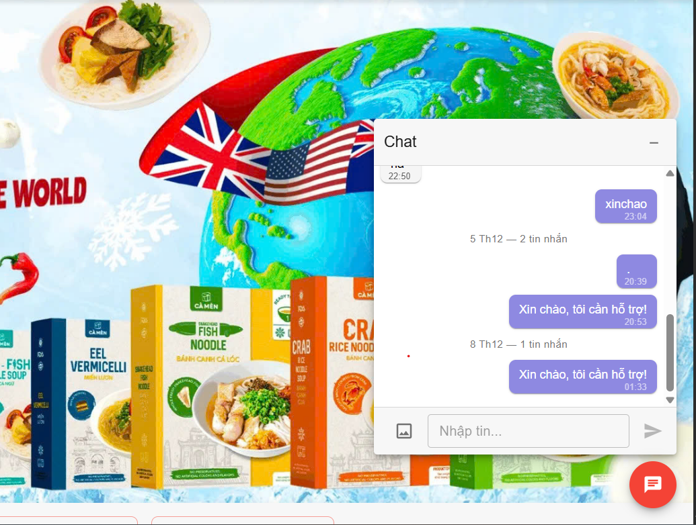
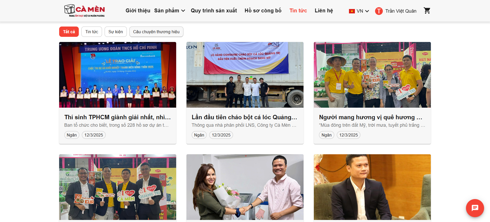
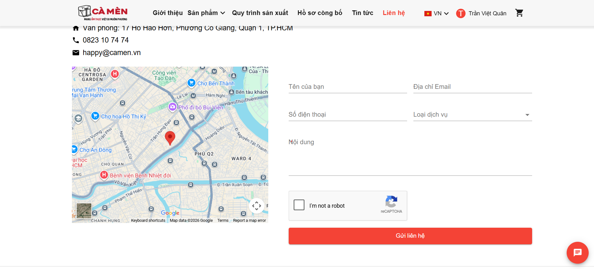
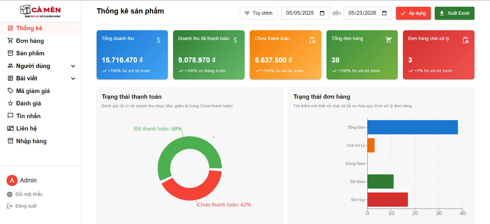
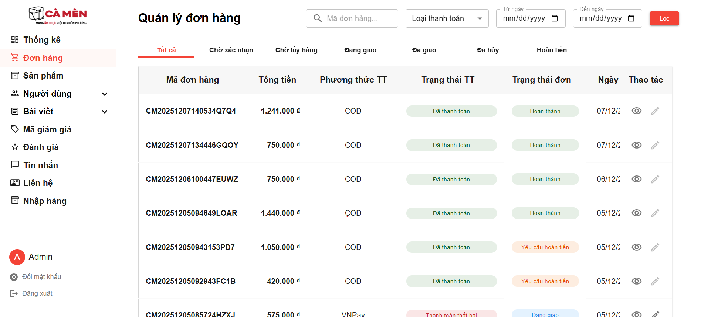
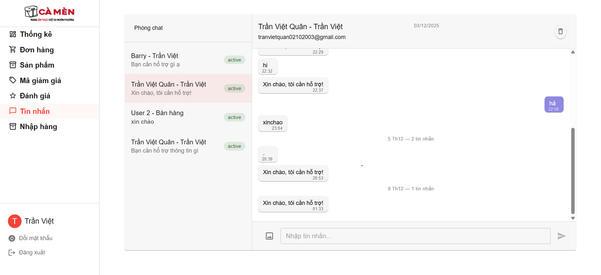

# CamenFood

> CamenFood is a modern e-commerce web application built with React, TypeScript, and MUI on the frontend, with a Laravel API backend and Laravel Reverb for real-time WebSocket communication. It supports multilingual browsing, secure authentication, and a complete shopping flow from cart to checkout.

---

## Features

- Real-time messaging with WebSocket
- User authentication
- Localization (vi-en)
- E-commerce Core (Shopping Cart, Checkout & Order Processing)
- Product Management
- Modern UI with MUI
- Secure communication with JWT authentication

---

## Screenshots

### Landing Page


_Welcome page showcasing CamenFood's features and benefits._

### Login



_Login page for user authentication and account access._

### Product Page


_Product listing page for browsing available items._


### Order



_Order detail screen for reviewing a single purchase._

### Purchase



_Purchase flow screen for checkout and payment confirmation._

### Chat



_Chat workspace for real-time user communication._

### Blog



_Blog page for news, updates, and featured content._

### Contact



_Contact page for customer support and inquiries._

### Overview



_Dashboard overview showing key business metrics and summaries._

### Orders



_Orders management screen for tracking all customer orders._

### Product Management


_Admin product management screen for creating and updating products._

### Chat Box



_Compact chat box used for quick messaging interactions._

### Employees Management


_Employee management screen for handling staff records and roles._

---

## Getting Started

### Prerequisites

- Node.js 20 or later
- npm, yarn, or pnpm

### Installation

1. Clone the repository:

```bash
git clone [your-repository-url]
cd KLTN_CAMEN
```

2. Install dependencies:

```bash
npm install
# or
yarn install
# or
pnpm install
```

3. Set up environment variables: create a `.env.local` file in the root directory and add the required variables for the React app and Laravel backend:

```bash
REACT_APP_BASE=http://localhost:8000/
REACT_APP_API_BASE_URL=http://localhost:8000/api/
REACT_APP_REVERB_HOST=localhost
REACT_APP_REVERB_PORT=8080
REACT_APP_REVERB_SCHEME=http
REACT_APP_REVERB_APP_KEY=your_reverb_app_key
```

4. Run the development server:

```bash
npm run dev
# or
yarn dev
# or
pnpm dev
```

Open http://localhost:3000 with your browser to see the application.

### Project Structure

```bash
src/
├── apis/         # API modules for backend communication
├── assets/       # Static assets, images, and fonts
├── common/       # Shared constants, helpers, and context
├── components/   # Reusable UI components
├── hooks/        # Custom React hooks
├── layouts/      # Application layout components
├── lib/          # WebSocket and utility setup
├── locates/      # Translation files for vi/en
├── pages/        # Feature pages and screens
├── router/       # Route definitions and guards
└── types/        # TypeScript type declarations
```

### Development

- Use `npm run build` to create a production build.
- Use `npm test` to run the test suite.
- Update the `.env.local` file when backend URLs or WebSocket settings change.

### Deployment

The frontend can be deployed on any static hosting platform, while the backend should run on Laravel with a database and Laravel Reverb enabled for real-time features. You can deploy the full stack on platforms such as a VPS, DigitalOcean, AWS, Google Cloud Platform, Heroku, Railway, or a custom server.

Make sure your chosen environment supports:

- Laravel API hosting
- WebSocket connections for Laravel Reverb
- A PHP runtime and database server
- SSL certificates for secure connections
